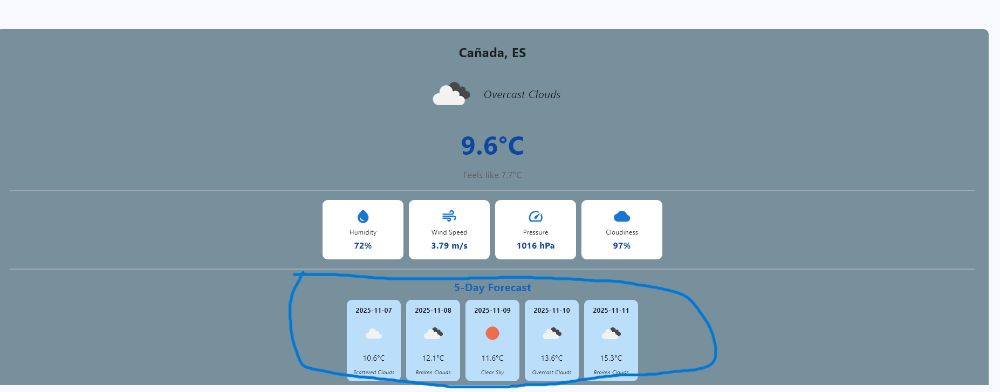
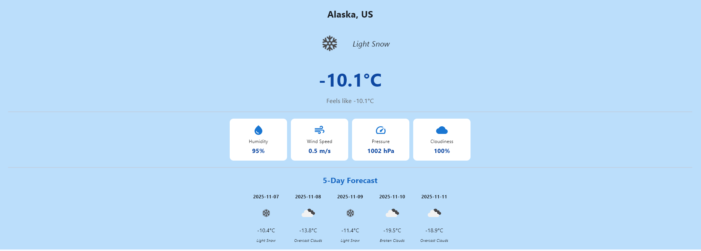
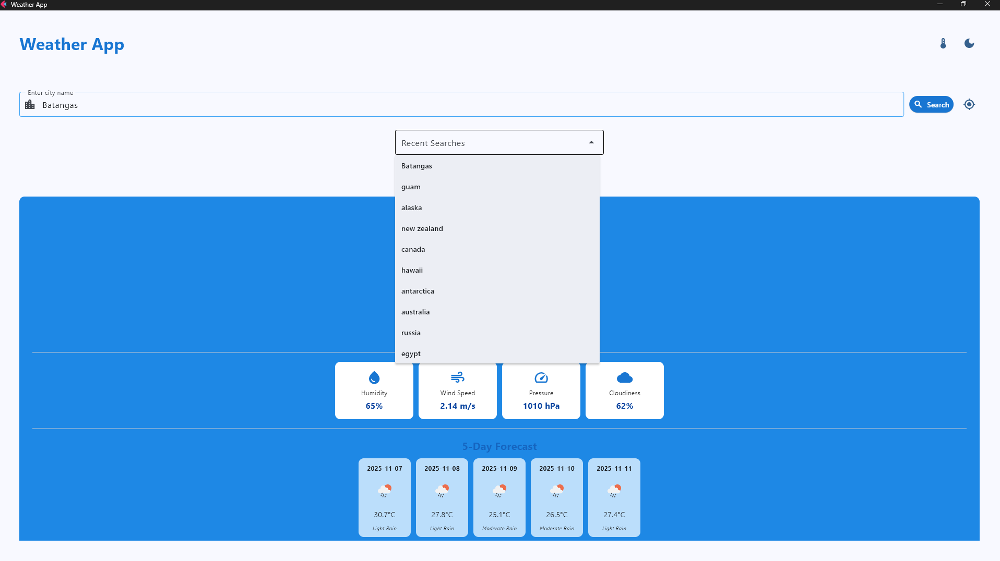

# Weather Application - Module 6 Lab

## Student Information
- **Name**: Carl Renz M. Colico  
- **Student ID**: 231002312  
- **Course**: CCCS 106 - Application Development  
- **Section**: BSCS 3-A  

---

## Project Overview
This Weather Application is a Python-based desktop and web app built using the **Flet** framework and the **OpenWeather API**.  
It allows users to view **real-time weather conditions**, a **5-day forecast**, and additional details such as humidity, wind speed, and cloudiness.  
The app also includes enhanced features like **dynamic background colors**, **geolocation-based weather**, and **search history tracking**, providing a more interactive and user-friendly experience.

---

## Features Implemented

### 🧱 Base Features
- [x] City search functionality  
- [x] Current weather display  
- [x] Temperature, humidity, and wind speed details  
- [x] Weather icons from OpenWeather  
- [x] Error handling for invalid inputs  
- [x] Modern UI with Material Design components  

---

### 🚀 Enhanced Features

#### 1. **Dynamic Background Color**
- **Description:** The app changes its background color dynamically based on weather conditions (e.g., sunny = yellow, rainy = blue, cloudy = gray).  
- **Why I chose this feature:** To make the interface visually responsive and give users an immediate sense of weather conditions through color.  
- **Challenges faced:** Handling intermediate weather conditions like “broken clouds” and ensuring smooth transitions between colors.  
- **Solution:** Implemented conditional logic in the `get_weather_style()` function to set custom colors for mixed conditions.

---

#### 2. **Geolocation-Based Weather**
- **Description:** Automatically fetches the user’s current location and displays the weather for that area.  
- **Why I chose this feature:** To improve usability by providing instant weather data without requiring manual input.  
- **Challenges faced:** Integrating geolocation with the OpenWeather API and handling cases where location access is denied.  
- **Solution:** Added fallback to manual search and structured clear error handling in the API call.

---

#### 3. **Search History**
- **Description:** Keeps track of previously searched cities for quick access.  
- **Why I chose this feature:** To let users easily revisit frequently checked locations.  
- **Challenges faced:** Storing and retrieving search history efficiently.  
- **Solution:** Implemented a JSON-based local storage system that saves searches and displays them dynamically.

---

#### 4. **5-Day Forecast Display**
- **Description:** Displays temperature and conditions for the next five days using icons and formatted dates.  
- **Why I chose this feature:** To give users better planning capability beyond the current weather.  
- **Challenges faced:** Parsing 3-hour interval data from the API and selecting representative times for daily summaries.  
- **Solution:** Used a loop to display forecast data at 8-step intervals (24-hour equivalent).

---

#### 5. **Temperature Unit Toggle**
- **Description:** Allows users to switch between Celsius and Fahrenheit.  
- **Why I chose this feature:** To make the app more versatile for international users.  
- **Challenges faced:** Maintaining consistent state updates after toggling the unit.  
- **Solution:** Used a state variable to dynamically recalculate and refresh UI values.

---

## 🖼️ Screenshots

Below are screenshots demonstrating various features of the app:

| Feature | Screenshot |
|----------|-------------|
| **5-Day Forecast** |  |
| **Current Location Weather** |  |
| **Dynamic Background Color** |  |
| **Search History** |  |
| **Temperature Unit Toggle** |  |


## Installation

### Prerequisites
- Python 3.8 or higher
- pip package manager

### Setup Instructions
```bash
# Clone the repository
git clone https://github.com/<username>/cccs106-projects.git
cd cccs106-projects/mod6_labs

# Create virtual environment
python -m venv venv
source venv/bin/activate  # On Windows: venv\Scripts\activate

# Install dependencies
pip install -r requirements.txt

# Create .env file
cp .env.example .env
# Add your OpenWeatherMap API key to .env


# WeatherApp 

# 🌦️ WeatherApp

A modern weather application built with [Flet](https://flet.dev), powered by the **OpenWeatherMap API**.  
It provides real-time weather updates, 5-day forecasts, search history, and a dynamic visual interface that adapts to weather conditions.

---

## 🌟 Features

- **Search Weather by City Name** — Displays current temperature, humidity, pressure, wind speed, and more.  
- **5-Day Forecast** — Shows weather data for the upcoming 5 days, including icons and descriptions.  
- **Dynamic Background Color** — Background color changes automatically based on the current weather condition  
  (☀️ sunny = yellow, 🌧️ rainy = blue, ☁️ cloudy = gray, etc.).  
- **Current Location Detection (Geolocation)** — Automatically detects the user’s city via IP-based location lookup on startup,  
  and can be refreshed using the **“My Location”** button.  
- **Search History** — Keeps track of the last 5–10 searched cities.  
  - Displays them in a dropdown menu.  
  - Allows quick re-search by selecting a previous entry.  
  - Data is persisted locally using a JSON file (`search_history.json`).  
- **User Feedback** — Displays friendly error messages for invalid inputs or network issues.  
- **Smooth Transitions** — Weather backgrounds and updates transition smoothly for a better user experience.  
- **Responsive Layout** — Automatically adjusts for desktop and web window resizing.  

---

## Implemented Enhanced Features (Required Documentation)

The following features were chosen from the enhancement list and implemented:

### 1. Search History (Beginner)
- Saves and displays the last 5–10 searched cities in a dropdown.  
- Allows quick re-searching and persists data across sessions using a JSON file.  
- Implemented via helper methods:  
  - `load_history()`  
  - `save_history()`  
  - `add_to_history(city)`

### 2. Dynamic Background Color (Easy)
- Background color automatically changes according to the current weather condition.  
- Example:  
  - ☀️ Sunny = Yellow  
  - 🌧️ Rainy = Blue  
  - ☁️ Cloudy = Gray  
  - ❄️ Snow = Blue_Grey 
  - ⛈️ Thunderstorm = DEEP_PURPLE
  - 🌫️ Foggy/Broken Clouds = Dark_Grey
  - 🌤️ Mild Weather/ Default = Teal
- Implemented via the method:  
  - `get_weather_style(description)`

### 3. Temperature Unit Toggle (Easy)
- Add a switch/button to toggle between Celsius and Fahrenheit
- Convert and redisplay current weather data

### 4. Current Location Weather (Medium)
- Uses **IP-based geolocation** to detect and display weather data for the user’s current city.  
- Activated on startup after running the main.py
- Implemented in the method:  
  - `get_current_location_weather()`

### 5. 5-Day Forecast (Medium)
- Displays forecast cards summarizing temperature and weather for the next 5 days.  
- Uses icons and text descriptions for each day.  
- Implemented within the method:  
  - `display_weather(data, forecast)`

---

## Run the app

### uv

Run as a desktop app:

```
uv run flet run
```

Run as a web app:

```
uv run flet run --web
```

### Poetry

Install dependencies from `pyproject.toml`:

```
poetry install
```

Run as a desktop app:

```
poetry run flet run
```

Run as a web app:

```
poetry run flet run --web
```

For more details on running the app, refer to the [Getting Started Guide](https://flet.dev/docs/getting-started/).

## Build the app

### Android

```
flet build apk -v
```

For more details on building and signing `.apk` or `.aab`, refer to the [Android Packaging Guide](https://flet.dev/docs/publish/android/).

### iOS

```
flet build ipa -v
```

For more details on building and signing `.ipa`, refer to the [iOS Packaging Guide](https://flet.dev/docs/publish/ios/).

### macOS

```
flet build macos -v
```

For more details on building macOS package, refer to the [macOS Packaging Guide](https://flet.dev/docs/publish/macos/).

### Linux

```
flet build linux -v
```

For more details on building Linux package, refer to the [Linux Packaging Guide](https://flet.dev/docs/publish/linux/).

### Windows

```
flet build windows -v
```

For more details on building Windows package, refer to the [Windows Packaging Guide](https://flet.dev/docs/publish/windows/).
=======
# CCCS 106 Projects
Application Development and Emerging Technologies  
Academic Year 2025-2026

## Student Information
- **Name:** Carl Renz M. Colico
- **Student ID:** 231002312
- **Program:** Bachelor of Science in Computer Science
- **Section:** BSCS-3A

## Repository Structure

### Week 1 Labs - Environment Setup and Python Basics
- `week1_labs/hello_world.py` - Basic Python introduction
- `week1_labs/basic_calculator.py` - Simple console calculator
### Week 2 Labs - Git and Flet GUI Development
- `week2_labs/hello_flet.py` - First Flet GUI application
- `week2_labs/personal_info_gui.py` - Enhanced personal information manager
- `week2_labs/enhanced_calculator.py` - GUI calculator (coming soon)
### Week 3 Labs
- `week3_labs/contact_book_cli.py` - Console-based Contact Book application
### Week 4 Labs
- `week4_labs/contact_book_app/` - Console-based Contact Book application
- `main.py` - Main Flet GUI application
- `app_logic.py` - Handles adding, displaying, editing, deleting, and searching contacts
- `database.py` - SQLite database integration for persistent contact storage
### Module 1 Final Project
- `module1_final/` - Final integrated project (TBD)

## Technologies Used
- **Python 3.8+** - Main programming language
- **Flet 0.28.3** - GUI framework for cross-platform applications
- **SQLite** - GUI framework for 
- **Git & GitHub** - Version control and collaboration
- **VS Code** - Integrated development environment

## Development Environment
- **Virtual Environment:** cccs106_env
- **Python Packages:** flet==0.28.3
- **Platform:** Windows 10/11

## How to Run Applications

### Prerequisites
1. Python 3.8+ installed
2. Virtual environment activated: `cccs106_env\Scripts\activate`
3. Flet installed: `pip install flet==0.28.3`

### Running GUI Applications
```cmd
# Navigate to project directory
cd week2_labs

# Run applications
python hello_flet.py
python personal_info_gui.py
Commit and push README.md

# Add the updated README.md file to the staging area
# This stages the modified README.md file so it will be included in the next commit
# Git tracks changes to this file and prepares it for version control
git add README.md

# Commit the staged changes with a descriptive message
# Creates a permanent snapshot of the README.md updates in the repository history
# The commit message should clearly describe what was changed for future reference
git commit -m "Update README.md with new application information"

# Push the committed changes to the remote GitHub repository
# Synchronizes your local main branch with the remote repository on GitHub
# This makes your updated README.md visible to others and backs up your changes git push origin main

### Running GUI Applications Week 3
```cmd
# Navigate to project directory
cd week3_labs
# Run applications
python contact_book_cli.py

### Running GUI Applications Week 4
# Navigate to project directory
cd week4_labs/contact_book_app
# Run applications
flet run main.py
>>>>>>> f4cc449bb60cda9c387660355486688f5aa6f9a0
