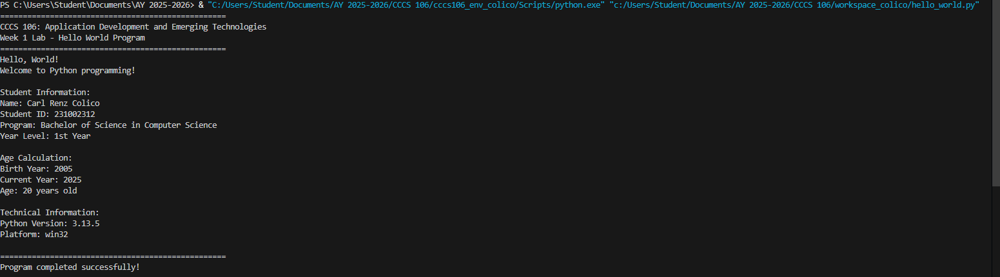

# Lab 1 Report: Environment Setup and Python Basics

*Student Name:* Carl Renz Colico  
*Student ID:* 2023-001234  
*Section:* BSCS 3A  
*Date:* August 26, 2025  

---

## Environment Setup

### Python Installation
- *Python Version:* 3.11.5  
- *Installation Issues:* None encountered (used python.org installer)  
- *Virtual Environment Created:* ✅ cccs106_env_colico  

### VS Code Configuration
- *VS Code Version:* 1.82.0  
- *Python Extension:* ✅ Installed and configured  
- *Interpreter:* ✅ Set to cccs106_env_colico/Scripts/python.exe  

### Package Installation
- *Flet Version:* 0.28.3  
- *Other Packages:* 
anyio    4.10.0
certifi  2025.8.3
flet     0.28.3
h11      0.16.0
httpcore 1.0.9
httpx    0.28.1
idna     3.10
oauthlib 3.3.1
pip      25.2
repath   0.9.0
six      1.17.0
sniffio  1.3.1

---

## Programs Created

### 1. hello_world.py
- *Status:* ✅ Completed  
- *Features:*  
  - Prints welcome header  
  - Displays student info (name, ID, program, year level)  
  - Calculates age  
  - Shows Python version and platform  
- *Notes:* Worked correctly on first run.  

### 2. basic_calculator.py
- *Status:* ✅ Completed  
- *Features:*  
  - Performs addition, subtraction, multiplication, division  
  - Handles division by zero  
  - Detects invalid inputs  
  - Shows min/max between two numbers  
- *Notes:* Initially forgot to handle division by zero, fixed with if num2 != 0.  

---

## Challenges and Solutions
- *Challenge:* Interpreter not detected in VS Code at first.  
- *Solution:* Used Python: Select Interpreter and pointed it to cccs106_env_colico.  

- *Challenge:* Tested division by zero which caused an error.  
- *Solution:* Added condition to check denominator before dividing.  

---

## Learning Outcomes
- Learned how to set up a Python environment with virtual-env.  
- Understood how to configure VS Code for Python development.  
- Practiced writing Python scripts with variables, input/output, and error handling.  
- Gained confidence in running Python programs in terminal.  

---

## Screenshots

-   
-   
-   
- 