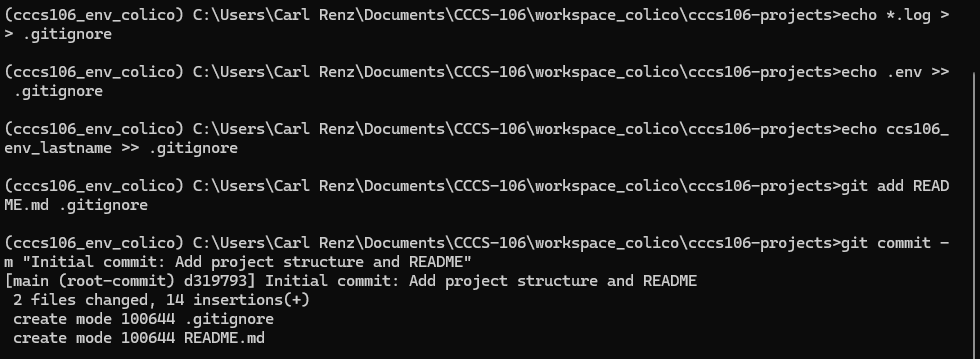
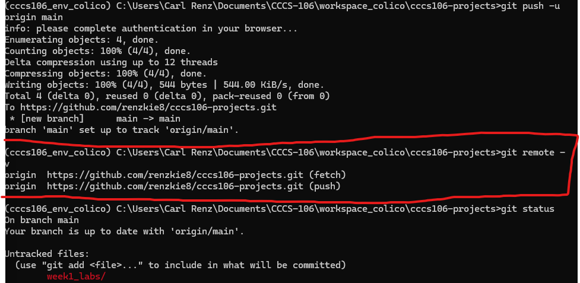
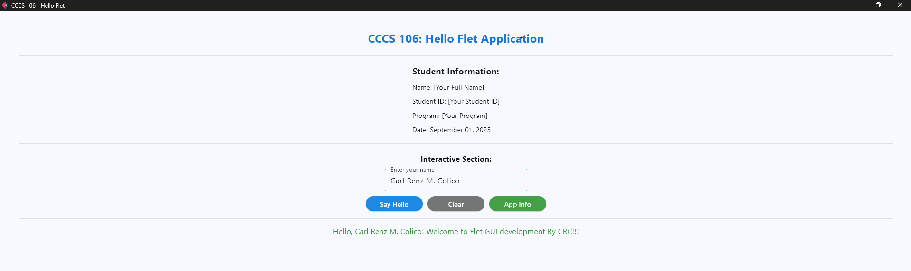

# Lab 2 Report: Git Version Control and Flet GUI Development

*Student Name:* Carl Renz Colico  
*Student ID:* 2023-001234  
*Section:* BSCS 3A  
*Date:* September 1, 2025  

---

### Git Configuration

### Repository Setup

GitHub Repository: https://github.com/renzkie8/cccs106-projects 

Local Repository: ✅ Initialized and connected

Commit History: 5+ commits with descriptive messages

### Git Skills Demonstrated

✅ Repository initialization and configuration

✅ Adding, committing, and pushing changes

✅ Branch creation and merging

✅ Remote repository management

## Flet GUI Applications
### 1. hello_flet.py
- **Status:** ✅ Completed
- **Features:** Interactive greeting, student info display, dialog boxes
- **UI Components:** Text, TextField, Buttons, Dialog, Containers
- **Notes:** [Any challenges or observations]

### 2. personal_info_gui.py
- **Status:** ✅ Completed
- **Features:** Form inputs, dropdowns, radio buttons, profile generation
- **UI Components:** TextField, Dropdown, RadioGroup, Containers, Scrolling
- **Error Handling:** Input validation and user feedback

Notes: Initially tricky to manage state but solved using Flet event handlers.

## Technical Skills Developed

### Git Version Control
- Understanding of repository concepts
- Basic Git workflow (add, commit, push)
- Branch management and merging
- Remote repository collaboration

### Flet GUI Development
- Flet 0.28.3 syntax and components
- Page configuration and layout management
- Event handling and user interaction
- Modern UI design principles

## Challenges and Solutions

Challenge: Flet not installed (ModuleNotFoundError).

Solution: Installed using pip install flet==0.28.3.

Challenge: Git push did not update repo.

Solution: Checked remote origin and used git push origin main.

Challenge: Validating form inputs in GUI.

Solution: Added conditions before processing form data.

Learning Outcomes

Gained practical experience in Git workflows (init, add, commit, push).

Learned how to create and merge branches.

Built interactive GUI apps using Flet components.

Understood the importance of validation and event-driven programming.

## Screenshots

- GitHub repository URL and screenshot of successful push
-   
-   

- Screenshots of both GUI applications running 
-   
- 

- GitHub repository URL showing complete commit history
-   

### Git Repository

 GitHub repo showing commits and branches

 Local git log history

### GUI Applications

 Running hello_flet.py with student info

 Running personal_info_gui.py with generated profile

### Future Enhancements

Add Save Profile feature (export to .txt or .json)

Add photo upload option in personal_info_gui.py

Improve styling (colors, fonts, spacing) for a modern look

Deploy the GUI as a standalone app (Flet supports packaging into EXE)